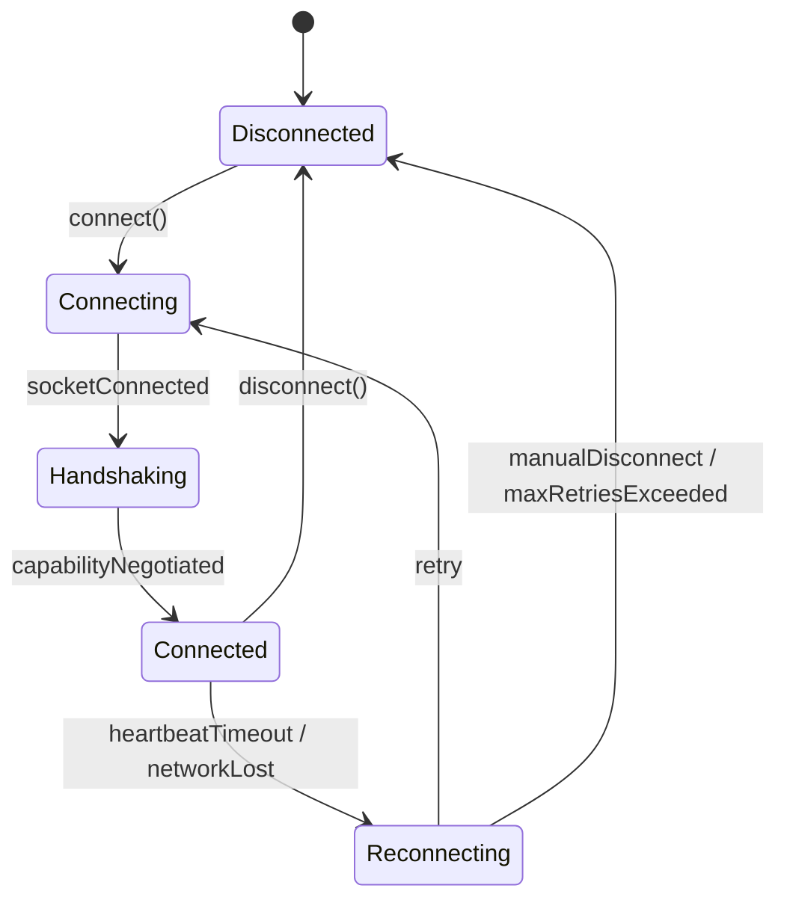

# Weylus Android Native Client — Architecture Freeze (Step 0)

This document defines the core interfaces, lifecycles, and protocols of the Weylus Android Native Client. These interfaces ensure long-term stability and modularity, allowing new transports (USB Bulk, QUIC) and video codecs (AV1, HEVC) to be added without refactoring the client application layers.

---

## 1. Session Lifecycle State Machine

A Session represents the high-level connection state of the client. It manages reconnection, heartbeats, and UI signaling.



### State Definitions
- **Disconnected**: Connection is idle. Resources (decoders, socket listeners) are released.
- **Connecting**: Transport layer is establishing the socket/tunnel connection.
- **Handshaking**: Socket is open; client has sent its capabilities and is awaiting server initialization.
- **Connected**: Video stream is active and input events are flowing.
- **Reconnecting**: Attempting to resume after a drop, maintaining current canvas state instead of resetting to the entry screen.

---

## 2. Transport Abstraction

The `Transport` interface decouples the network socket protocol from the session management logic. This allows easy migration from WebSocket to raw USB Bulk (AOA) or UDP-based QUIC.

```kotlin
package com.weylus.studio.net.transport

interface TransportListener {
    fun onConnected()
    fun onDisconnected(reason: String?)
    fun onBinaryMessageReceived(bytes: ByteArray)
    fun onTextMessageReceived(text: String)
}

interface Transport {
    fun connect(host: String, port: Int, listener: TransportListener)
    fun sendBinary(bytes: ByteArray): Boolean
    fun sendText(text: String): Boolean
    fun disconnect()
    val isConnected: Boolean
    val transportType: TransportType
}

enum class TransportType {
    WEBSOCKET_ADB,
    WEBSOCKET_WIFI,
    USB_BULK_AOA,
    QUIC
}
```

---

## 3. Capability Negotiation

Handshaking is strictly negotiation-driven. The client declares its capabilities on connection; the server selects options and replies with the active configuration.

### Client Declaration (Sent on connect)
```json
{
  "capabilities": {
    "virtual_keyboard": true,
    "uinput": true,
    "hover": true,
    "clipboard": true,
    "pressure": true
  }
}
```

### Server Configuration Response (Received before stream starts)
```json
{
  "uinput_support": true,
  "capturable_id": 0,
  "capture_cursor": true,
  "max_width": 1920,
  "max_height": 1080,
  "client_name": "Samsung Galaxy Tab S9",
  "frame_rate": 60.0
}
```

---

## 4. Decoder Abstraction

The `VideoDecoder` interface separates video packet consumption and hardware decoding from the display Surface pipeline.

```kotlin
package com.weylus.studio.video

import android.view.Surface

interface DecoderListener {
    fun onFrameDecoded(timestampUs: Long)
    fun onError(error: Throwable)
}

interface VideoDecoder {
    fun configure(surface: Surface, width: Int, height: Int, listener: DecoderListener)
    fun feedPacket(bytes: ByteArray, timestampUs: Long)
    fun flush()
    fun release()
    val codecType: CodecType
}

enum class CodecType {
    H264_AVC,
    H265_HEVC,
    AV1
}
```

### MediaCodecDecoder Implementation Guidelines
- Configure the native MediaCodec for `video/avc`.
- Enforce low-latency decoding flags:
  ```kotlin
  format.setInteger(MediaFormat.KEY_LOW_LATENCY, 1)
  format.setInteger(MediaFormat.KEY_PRIORITY, 0) // Real-time priority
  ```
- Directly output decoded frames to the provided rendering `Surface`.

---

## 5. Protocol Versioning & Constants

To prevent client-server drift, all WebSocket packets are version-guarded:
- **Protocol Version**: `1`
- **Port mapping default**: `1701`
- **Pacing Metric Targets**:
  - Target Roundtrip Latency: `< 10 ms`
  - Max Jitter Allowance: `2 ms`
  - Frame Pacing: Rely on Android's Choreographer rendering callbacks aligned with display refresh rate.
