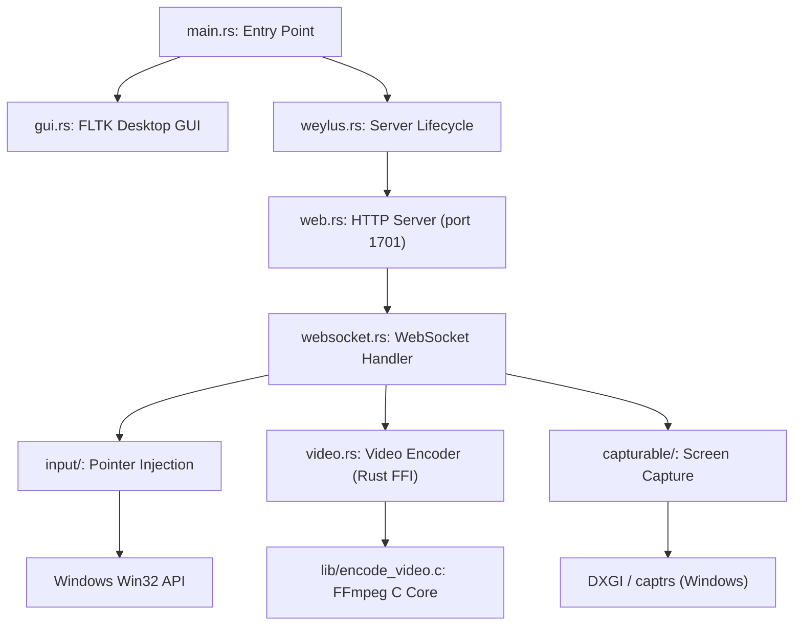
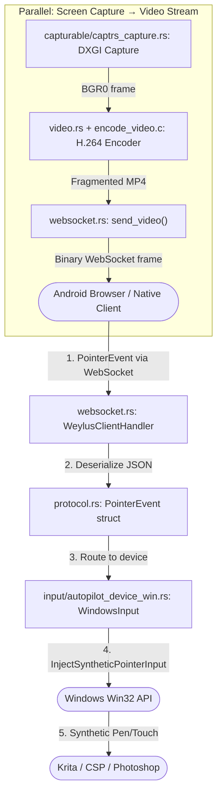
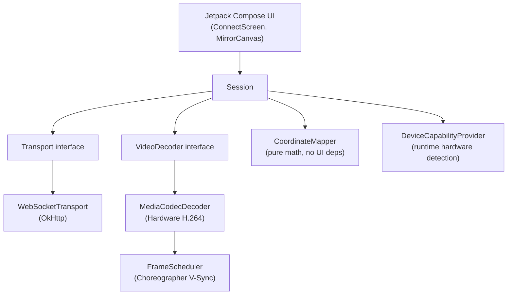

# Weylus Studio — Architecture & Developer Reference Guide

This document provides a full architectural breakdown of the Weylus Studio codebase, covering the data flow from the tablet stylus all the way through to Windows input injection, along with component references, Windows API integration notes, and developer collaboration rules.

---

## Document Index & Changelog Timeline

| Section | Focus Area | Date | Key Design Patterns |
| :--- | :--- | :--- | :--- |
| **Section 1** | Codebase Layout & Dependency Diagrams | 2026-06-18 | Modular OS-conditional compilation, Rust FFI to C FFmpeg |
| **Section 2** | End-to-End Data Flow (Stylus → Windows) | 2026-06-18 | WebSocket protocol, pointer event serialization, Win32 injection |
| **Section 3** | Windows Input Injection (Win32 API) | 2026-06-18 | `CreateSyntheticPointerDevice`, pressure, tilt, multitouch |
| **Section 4** | Video Capture & Encoding Pipeline | 2026-06-18 | DXGI capture, FFmpeg H.264, MediaFoundation/NVENC hardware acceleration |
| **Section 5** | AI Assistant Collaboration Rules | 2026-06-18 | Safety constraints, unsafe Rust boundaries, non-goals |
| **Section 6** | Android Native Client Architecture | 2026-07-08 | Kotlin + Compose, decoupled Transport/Session/Decoder/Input layers |

---

## Section 1: Codebase Layout & Dependency Diagrams
* **Introduced**: 2026-06-18 (initial documentation pass)

### Project Directory Layout

```text
Weylus-Studio/
├── src/
│   ├── main.rs                        # Entry point: CLI parsing, GUI/headless mode selection
│   ├── gui.rs                         # FLTK desktop GUI (Start button, QR code, log display)
│   ├── web.rs                         # Hyper HTTP server (port 1701) serving browser frontend
│   ├── websocket.rs                   # WebSocket handler: receives pointer events, drives video loop
│   ├── protocol.rs                    # Serde data types: PointerEvent, WheelEvent, KeyboardEvent
│   ├── video.rs                       # Rust wrapper around C FFmpeg encoder (FFI bridge)
│   ├── config.rs                      # CLI config via clap: ports, access code, encoder options
│   ├── weylus.rs                      # Weylus server lifecycle manager (start/stop)
│   ├── cerror.rs                      # C error struct bridged to Rust for FFmpeg error handling
│   ├── log.rs                         # Logging setup: tracing-subscriber with mpsc log forwarding to GUI
│   ├── capturable/
│   │   ├── mod.rs                     # Capturable trait + platform dispatch
│   │   ├── win_ctx.rs                 # Windows: DXGI adapter/monitor enumeration
│   │   ├── captrs_capture.rs          # Windows: screen capture via captrs crate
│   │   ├── x11.rs                     # Linux: X11 shared memory capture
│   │   ├── pipewire.rs                # Linux: Wayland screen capture via PipeWire/GStreamer
│   │   ├── remote_desktop_dbus.rs     # Linux: Wayland RemoteDesktop portal via D-Bus
│   │   ├── core_graphics.rs           # macOS: CoreGraphics capture
│   │   └── testsrc.rs                 # Cross-platform synthetic test source (for benchmarks)
│   └── input/
│       ├── mod.rs                     # Input module exports
│       ├── device.rs                  # InputDevice trait + InputDeviceType enum
│       ├── autopilot_device.rs        # Cross-platform fallback: mouse emulation via autopilot-rs
│       ├── autopilot_device_win.rs    # Windows primary: Win32 synthetic pen + touch injection
│       ├── uinput_device.rs           # Linux primary: uinput kernel module (full stylus support)
│       ├── uinput_keys.rs             # Linux: key code mapping table for uinput
│       └── macos_tablet.rs            # macOS: tablet input via CGEvent
├── build.rs                           # Build dispatcher: routes to OS-specific build module (28 lines)
├── build/
│   ├── common.rs                      # Shared build: TypeScript (npx/tsc), C helpers (cc::Build)
│   ├── windows.rs                     # Windows build: prebuilt .lib linking, Win32 system libs
│   ├── linux.rs                       # Linux build: FFmpeg source compile, X11/VA-API/DRM libs
│   └── macos.rs                       # macOS build: FFmpeg source compile, Apple framework libs
├── ts/
│   └── lib.ts                         # Frontend TypeScript (43KB): PointerEvent capture, WebSocket, H.264 MSE player
├── www/
│   ├── static/                        # Compiled lib.js and assets served by the HTTP server
│   └── templates/                     # Handlebars HTML templates (index page, access page)
├── lib/
│   ├── encode_video.c                 # C FFmpeg wrapper: H.264 encoding, NVENC, MediaFoundation, VAAPI
│   ├── error.c / error.h              # C error propagation helpers
│   └── log.c / log.h                  # C logging helpers
├── deps/
│   ├── build.sh                       # FFmpeg + libx264 build script (Linux/macOS only, requires bash)
│   ├── prebuilt_windows/              # Windows prebuilt FFmpeg/x264 .lib files (locally compiled cache)
│   └── dist_{os}/                     # Built FFmpeg static/dynamic libraries (generated, gitignored)
├── Cargo.toml                         # Rust dependencies and platform-conditional deps
├── build_ffmpeg_source_backup.rs      # Original monolithic build.rs backup (reference only)
└── android/                           # Native Android client (Phase 3)
    └── app/src/main/java/com/weylus/studio/
        ├── MainActivity.kt            # Entry point: lifecycle, orientation change dispatch
        ├── net/
        │   ├── Transport.kt           # Transport interface (connect/sendText/sendBinary/disconnect)
        │   ├── WebSocketTransport.kt  # OkHttp WebSocket implementation of Transport
        │   └── Session.kt             # Session state machine + SessionListener callbacks
        ├── input/
        │   ├── CoordinateMapper.kt    # Pure math: aspect-ratio + letterbox coordinate projection
        │   └── DeviceCapabilityProvider.kt  # Runtime stylus/display hardware detection
        ├── video/
        │   ├── VideoDecoder.kt        # VideoDecoder interface
        │   ├── MediaCodecDecoder.kt   # MediaCodec H.264 hardware decoder implementation
        │   └── FrameScheduler.kt      # Choreographer-backed V-Sync frame scheduler
        └── ui/
            ├── ConnectScreen.kt       # Compose UI: server discovery and connection form
            └── MirrorCanvas.kt        # Compose Canvas: decoded frame rendering surface
```

### Dependency Graph



### Data Flow: Stylus → Windows Pointer Injection



---

## Section 2: End-to-End Data Flow (Stylus → Windows)

The core communication loop operates over two parallel WebSocket channels:

### Inbound (Tablet → PC): Pointer Events
1. The TypeScript frontend (`ts/lib.ts`) listens for `pointerdown`, `pointermove`, `pointerup` events using the browser's `PointerEvents` API.
2. For each event, it serializes the data — including `x`, `y`, `pressure` (0.0–1.0 float), `tiltX`, `tiltY`, `twist`, `pointerType` (`"pen"` / `"touch"` / `"mouse"`), and `pointerId` — into a JSON `PointerEvent` message.
3. The Rust server's `websocket.rs` receives the JSON, deserializes it via `serde_json` into the typed `PointerEvent` struct defined in `protocol.rs`, and dispatches it to the active `InputDevice` implementation.
4. On Windows, `WindowsInput` (`autopilot_device_win.rs`) translates this into a Win32 `POINTER_PEN_INFO` or `POINTER_TOUCH_INFO` structure and calls `InjectSyntheticPointerInput`.

### Outbound (PC → Tablet): Video Stream
1. The `handle_video` loop in `websocket.rs` runs on a dedicated thread, capturing frames at the configured frame rate.
2. Each frame is passed as a `PixelProvider` (BGR0 format) to the `VideoEncoder` in `video.rs`.
3. The encoder calls the C FFmpeg wrapper (`lib/encode_video.c`) to compress the frame as H.264 in a Fragmented MP4 container.
4. Encoded packets are sent back to the tablet via binary WebSocket frames.
5. The TypeScript frontend plays the stream using the browser's `MediaSource` Extensions API (MSE).

---

## Section 3: Windows Input Injection (Win32 API)

### API Used
Weylus Studio uses the **Synthetic Pointer Input API** introduced in Windows 10 (Build 1903+):

| API Call | Purpose |
| :--- | :--- |
| `CreateSyntheticPointerDevice(PT_PEN, 1, 1)` | Create a virtual pen device (1 contact point) |
| `CreateSyntheticPointerDevice(PT_TOUCH, 5, 1)` | Create a virtual touch device (up to 5 contact points) |
| `InjectSyntheticPointerInput(handle, &info, count)` | Inject pen or touch events into the Windows input system |
| `InitializeTouchInjection(5, TOUCH_FEEDBACK_DEFAULT)` | Initialize legacy touch injection (fallback path) |
| `DestroySyntheticPointerDevice(handle)` | Release device handles on cleanup |

### Pen Data Mapping

| Protocol Field (`protocol.rs`) | Win32 Field (`POINTER_PEN_INFO`) | Notes |
| :--- | :--- | :--- |
| `event.pressure` (0.0–1.0) | `penInfo.pressure` (0–1024) | Multiplied by 1024 |
| `event.tilt_x` (degrees) | `penInfo.tiltX` | Direct pass-through |
| `event.tilt_y` (degrees) | `penInfo.tiltY` | Direct pass-through |
| `event.twist` (degrees) | `penInfo.rotation` | Direct pass-through |
| `event.x * width + offset_x` | `pointerInfo.ptPixelLocation.x` | Mapped to virtual screen coordinates |

### Multitouch Architecture
- Active touch contacts are tracked in `multitouch_map: HashMap<i64, POINTER_TYPE_INFO>`.
- On each touch `MOVE` event, all active contacts in the map are re-injected together in a single `InjectSyntheticPointerInput` call (required by the Win32 API — all active contacts must be reported simultaneously).
- Contacts are removed from the map on `UP`, `CANCEL`, `LEAVE`, or `OUT` events.

---

## Section 4: Video Capture & Encoding Pipeline

### Windows Screen Capture
- `win_ctx.rs` enumerates DXGI adapters and connected monitors using `CreateDXGIFactory1`.
- `captrs_capture.rs` uses the `captrs` crate to perform GPU-accelerated DXGI Desktop Duplication captures.
- Captured frames are exposed as `PixelProvider::BGR0S` (BGR with stride) to the encoding pipeline.

### FFmpeg H.264 Encoding
- The Rust `VideoEncoder` struct (`video.rs`) is a safe wrapper over a C context created in `lib/encode_video.c`.
- Frames are pushed as raw pixel buffers; the C layer handles YUV conversion via `libswscale` and H.264 encoding via `libx264`.
- Encoded packets are returned to Rust via a function pointer callback (`write_video_packet`), avoiding any heap copies.

### Hardware Acceleration (Windows)
| Encoder | Flag | Status |
| :--- | :--- | :--- |
| Software x264 | (default) | Always available |
| NVIDIA NVENC | `try_nvenc: true` | Requires NVIDIA drivers |
| Microsoft MediaFoundation | `try_mediafoundation: true` | Built-in Windows 10+ |

Hardware acceleration is disabled by default due to quality variability across hardware.

---

## Section 5: AI Assistant Collaboration Rules

Any AI assistant collaborating on this codebase must adhere to the rules in [[CONSTRAINTS]] and respect the milestones in [[ROADMAP]].

### Strict Prohibitions
1. **No modifications to the Windows API call structure** without verifying against official Microsoft Win32 documentation. The pointer injection calls are safety-critical.
2. **No removal of `unsafe` blocks without replacement** — every `unsafe` block in `autopilot_device_win.rs` exists because it crosses the Rust/Win32 boundary.
3. **No changes to `protocol.rs` field names** without simultaneously updating `ts/lib.ts` and the Android native client's serializable payload models.
4. **No additional `Box::into_raw()` usage** without a corresponding `Box::from_raw()` or an explicit documented justification.

### Core Standards
* **Platform-conditional code**: Use `#[cfg(target_os = "windows")]` for all Windows-specific logic. Never put Windows-only code in a non-conditional block.
* **Error handling**: Use `warn!()` from the `tracing` crate for recoverable errors.
* **Memory safety in unsafe blocks**: Any `Box::into_raw()` must be paired with `Box::from_raw()` in the same function scope, or replaced with a borrow (`as_mut_ptr()`) when the callee does not take ownership. See [[CASE_STUDIES#Chapter 1 Memory Leak in Windows Touch Injection]] for details.

---

## Section 6: Android Native Client Architecture
* **Introduced**: 2026-07-08 (Phase 3 Architecture Freeze)

The Android Native Client is a pure Kotlin + Jetpack Compose application that connects directly to the Rust server's WebSocket protocol. It replaces the browser-based web client for the Android platform.

### Platform Strategy

| Platform | Client Approach | Reason |
| :--- | :--- | :--- |
| **Android** | Kotlin Native (this module) | `MotionEvent` stylus APIs (pressure, tilt, hover) require native access; browser sandboxing adds unacceptable latency |
| **macOS** | Web browser (existing) | No tablet-primary use case; Apple Pencil targets iPad, not Mac |
| **Linux** | Web browser (existing) | Wacom tablet support via browser Pointer Events API is sufficient; desktop-class workflow |
| **iOS** (Phase 5+) | Swift/SwiftUI (future) | Apple Pencil on iPad requires native `UITouch` force and azimuth APIs |

### Component Architecture



### Layer Isolation Rules

| Layer | May Depend On | Must NOT Depend On |
| :--- | :--- | :--- |
| `Transport` | OkHttp, stdlib | Session, UI, Decoder |
| `Session` | Transport, protocol types | UI Composables, MediaCodec |
| `VideoDecoder` | Android MediaCodec API | Session, WebSocket, UI |
| `FrameScheduler` | Choreographer | MediaCodec internals, Session |
| `CoordinateMapper` | Kotlin stdlib only | Android SDK, Session, UI |
| `UI (Compose)` | Session (via callbacks), CoordinateMapper | Transport, MediaCodec, WebSocket |

### Protocol Wire Format (Kotlin ↔ Rust)

The Android client serializes all messages using `kotlinx.serialization` to match `src/protocol.rs` Serde types exactly.

| Rust Type (`protocol.rs`) | Kotlin Equivalent | Direction |
| :--- | :--- | :--- |
| `PointerEvent` | `PointerEvent` data class | Client → Server |
| `WheelEvent` | `WheelEvent` data class | Client → Server |
| `KeyboardEvent` | `KeyboardEvent` data class | Client → Server |
| `ClientConfiguration` + `ClientCapabilities` | `ClientConfig` data class | Client → Server (handshake) |
| `MessageOutbound::VideoFrame` | `ByteArray` (binary) | Server → Client |
| `MessageOutbound::DisplayCapability` | `DisplayCapability` data class | Server → Client (once) |
| `MessageOutbound::DisplayChanged` | `DisplayChanged` data class | Server → Client (runtime) |

> [!IMPORTANT]
> Any rename of a field in `src/protocol.rs` **must** be simultaneously reflected in the Kotlin `@SerialName` annotations in the Android client. A protocol drift will silently corrupt input injection on the server side.

### Telemetry & Latency Observability (FrameTiming)

To guarantee a low-latency, stutter-free 120Hz drawing experience, a passive telemetry pipeline measures end-to-end delay at each stage of the frame rendering path.

```text
Host PC           WebSocket (TCP)           MediaCodec.dequeue       V-Sync (Choreographer)
  [Capture] ──> [onBinaryMessageReceived] ──> [onFrameDecoded] ──> [onFramePresented]
                         │                           │                       │
                         ▼                           ▼                       ▼
                  receiveTimestampUs          decodeTimestampUs       presentTimestampUs
```

1. **receiveTimestampUs**: Captured immediately on the network thread when a binary frame payload is delivered to `Session.onBinaryMessageReceived()`. Uses monotonic microsecond clock (`System.nanoTime() / 1000L`).
2. **decodeTimestampUs**: Captured by `MediaCodecDecoder` when `dequeueOutputBuffer` successfully returns a completed frame index, before delegating the presentation to the frame scheduler.
3. **presentTimestampUs**: Captured by `ChoreographerFrameScheduler` immediately after the release action (which commits the decoded buffer to the display surface) is executed on the next V-Sync boundary.

**Latency Metrics**:
* **Decode Latency**: `decodeTimestampUs - receiveTimestampUs` (Measures decoder queue delay & hardware time).
* **Present Latency**: `presentTimestampUs - decodeTimestampUs` (Measures V-Sync alignment wait time inside the scheduler).
* **Total Client Latency**: `presentTimestampUs - receiveTimestampUs` (Total delay added by the Android client package).

Every frame metrics summary is logged to Android system log under the tag `FrameTiming`:
`FrameTiming | size=14820B | decode=3.10ms | present=1.20ms | total=4.30ms`

